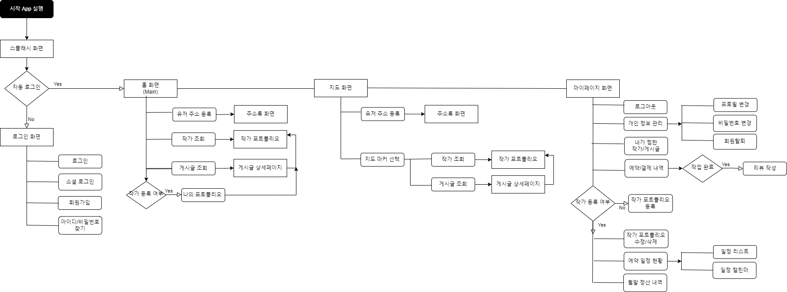

# ​🧡📷스마일(​SMILE)📷🧡


- SSAFY 8th PJT **Team D102**​ 🌞
- 프로젝트 기간 : `2023.01.03` ~ `2023.02.17`


<br>

# :green_book:​Contents

[:one:​ Specification](#one-specification)<br>
[:two:​ Flow Chart](#two-flow-chart)<br>
[:three:​ ERD](#three-erd)<br>
[:four:​ WIKI](#four-wiki)<br>
[:five:​ Contributor](#six-contributor)<br>


<br>

## ​:one:​ Specification

<table class="tg">
<tbody>
  <tr>
    <td><b>Architecture</b></td>
    <td>MVVM</td>
  </tr>
<tr>
    <td><b>Design Pattern</b></td>
<td>Singleton Pattern</td>
</tr>
<tr>
    <td><b>Jetpack Components</b></td>
<td>DataBinding, LiveData, ViewModel, Lifecycle</td>
</tr>
<tr>
    <td><b>Dependency Injection</b></td>
<td>Koin</td>
</tr>
<tr>
    <td><b>Network</b></td>
<td>OkHttp, Retrofit2</td>
</tr>
<tr>
    <td><b>Strategy</b></td>
<td>Git Flow</td>
</tr>

<tr>
    <td><b>Third Party Library</b></td>
    <td> - - - </td>

</tr>
<tr>
    <td><b>Other Tool</b></td>
<td>Notion, Slack</td>
</tr>
</tbody>
</table>

<br>

<br>

## :two:​ Flow Chart




<br>

## :three:​ ERD


<br>

## :four:​ WIKI
```
👉 Team Rules(Git, Coding Convention) 및 회의록
```
- [HOME](https://lab.ssafy.com/s08-webmobile4-sub1/S08P11D102/-/wikis/Home)
  - [1. Team Rules](https://lab.ssafy.com/s08-webmobile4-sub1/S08P11D102/-/wikis/1.-Team-Rules)
  - [2. Android Coding Convention](https://lab.ssafy.com/s08-webmobile4-sub1/S08P11D102/-/wikis/2.-Android-Coding-Convention)
  - [3. Server Coding Convention]()
  - [4. 회의록]()


<br>


## :five:​ Contributor

```
👉 팀원 소개와 역할 분담
```

<table class="tg">
<tbody>
    <tr>
        <td>이지윤</td>
        <td>이민하</td>
        <td>김면길</td>
    </tr>
    <tr>
        <td><a href="https://github.com/git-link">@git-id</a></td>
        <td><a href="https://github.com/git-link">@git-id</a></td>
        <td><a href="https://github.com/git-link">@git-id</a></td>
    </tr>
    <tr>
        <td></td>
        <td></td>
        <td></td>
    </tr>
    <tr>
        <td>Android Dev</td>
        <td>Android Dev</td>
        <td>Android Dev</td>
    </tr>
    <tr>
        <td>담당한 개발 기능</td>
        <td>담당한 개발 기능</td>
        <td>담당한 개발 기능</td>
    </tr>
</tbody>
<tbody>
    <tr>
        <td>김정은</td>
        <td>신민철</td>
        <td>서재건</td>
    </tr>
    <tr>
        <td><a href="https://github.com/git-link">@git-id</a></td>
        <td><a href="https://github.com/git-link">@git-id</a></td>
        <td><a href="https://github.com/git-link">@git-id</a></td>
    </tr>
    <tr>
        <td></td>
        <td></td>
        <td></td>
    </tr>
    <tr>
        <td>Server Dev</td>
        <td>Server Dev</td>
        <td>Server Dev</td>
    </tr>
    <tr>
        <td>담당한 개발 기능</td>
        <td>담당한 개발 기능</td>
        <td>담당한 개발 기능</td>
    </tr>
</tbody>
</table>


