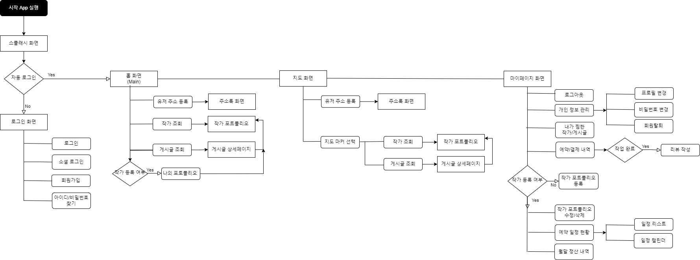

# ​🧡📷스마일(​SMILE)📷🧡


- SSAFY 8th PJT **Team D102**​ 🌞
- 프로젝트 기간 : `2023.01.03` ~ `2023.02.17`


<br>

# :green_book:​Contents

[:one:​ Specification](#one-specification)<br>
[:two:​ Flow Chart](#two-flow-chart)<br>
[:three:​ Package Structure](#three-package-structure)<br>
[:four:​ WIKI](#four-wiki)<br>
[:five:​ 핵심 기능 구현 방법 설명](#five-핵심-기능-구현-방법-설명)<br>
[:six:​ Contributor](#six-contributor)<br>


<br>

## ​:one:​ Specification

<table class="tg">
<tbody>
  <tr>
    <td><b>Architecture</b></td>
    <td>Clean Architecture, MVVM</td>
  </tr>
<tr>
    <td><b>Design Pattern</b></td>
<td>SSA(Single-Activity-Architecture), Singleton</td>
</tr>
<tr>
    <td><b>Jetpack Components</b></td>
<td>Navigation Component, ViewBinding, LiveData, ViewModel, Lifecycle, Room/SQLite</td>
</tr>
<tr>
    <td><b>Network</b></td>
<td>Retrofit2, OkHttp</td>
</tr>
<tr>
    <td><b>Third Party Library</b></td>
    <td>Coroutine, Glide, Image Cropper, TedPermission, Lottie, Spin-kit, Naver map API, Kakao Address API, Firebase(FCM & Hosting)</td>
</tr>
<tr>
    <td><b>Other Tool</b></td>
<td>Jira, Git, Notion, Slack, Figma, Zeplin</td>
</tr>
<tr>
    <td><b>Strategy</b></td>
<td>Jira & Git Flow</td>
</tr>
</tbody>
</table>

<br>

<br>

## :two:​ Flow Chart




<br>

## :three:​ Package Structure

```
📦 com.ssafy.smile
 ┣ 📂 common
 ┣ 📂 data
 ┃ ┗ 📂 local
 ┃ ┃ ┣ 📂 database
 ┃ ┃ ┃ ┣ 📂 dao
 ┃ ┃ ┃ ┣ 📂 entity
 ┃ ┃ ┗ 📂 datasource
 ┃ ┃ ┗ 📂 repository
 ┃ ┗ 📂 remote
 ┃ ┃ ┗ 📂 model
 ┃ ┃ ┗ 📂 datasource
 ┃ ┃ ┗ 📂 repository
 ┃ ┃ ┗ 📂 datasource
 ┃ ┃ ┗ 📂 service
 ┣ 📂 domain
 ┃ ┗ 📂 model
 ┃ ┗ 📂 repository
 ┣ 📂 presentation
 ┃ ┗ 📂 adapter
 ┃ ┗ 📂 base
 ┃ ┗ 📂 view
 ┃ ┃ ┣ 📂 home
 ┃ ┃ ┣ 📂 map
 ┃ ┃ ┣ 📂 mypage
 ┃ ┃ ┣ 📂 portfolio
 ┃ ┃ ┣ 📂 user
 ┃ ┃ ┣ 📂 splash
 ┃ ┗ 📂 viewmodel
 ┗ 📜 MainActivity.kt
 ┗ 📜 Application.kt
```


<br>

## :four:​ WIKI
```
👉 Team Rules(Git, Coding Convention) 및 회의록
```
- [HOME](https://lab.ssafy.com/s08-webmobile4-sub1/S08P11D102/-/wikis/Home)
  - [1. Team Rules](https://lab.ssafy.com/s08-webmobile4-sub1/S08P11D102/-/wikis/1.-Team-Rules)
  - [2. Android Coding Convention](https://lab.ssafy.com/s08-webmobile4-sub1/S08P11D102/-/wikis/2.-Android-Coding-Convention)
  - [3. Server Coding Convention]()
  - [4. 회의록]()


<br>

## :five:​ 핵심 기능 구현 방법 설명

```
👉 WIKI에 핵심 기능 구현 코드 및 방법 정리
```

[1. 스플래시]()

[2. 로그인]()

[3. 회원가입]()

[4. 주소록]()

[5. 작가 포트폴리오]()

[6. 게시글 및 지도]()

[7. 검색 및 필터링]()

[8. 예약 및 결제]()

[9. 나의 관심 내역]()

[10. 작가 추천]()


<br>

## :six:​ Contributor

```
👉 팀원 소개와 역할 분담
```

<table class="tg">
<tbody>
    <tr>
        <td>이지윤</td>
        <td>이민하</td>
    </tr>
    <tr>
        <td><a href="https://https://github.com/jiy00nLee">@jiy00nLee</a></td>
        <td><a href="https://github.com/minha721">@minha721</a></td>
    </tr>
    <tr>
        <td></td>
        <td></td>
    </tr>
    <tr>
        <td>Android Dev</td>
        <td>Android Dev</td>
    </tr>
    <tr>
        <td>구조 설계, 주소록, 지도, 주변 게시글 목록, 작가 포트폴리오/게시글 작성, 유저 리뷰 조회, 내가 찜한 목록</td>
        <td>회원가입, 로그인/소셜로그인, 주변 작가 목록, 작가 포트폴리오/게시글 검색 및 조회, 예약/결제, 작가 추천</td>
    </tr>
</tbody>
</table>


