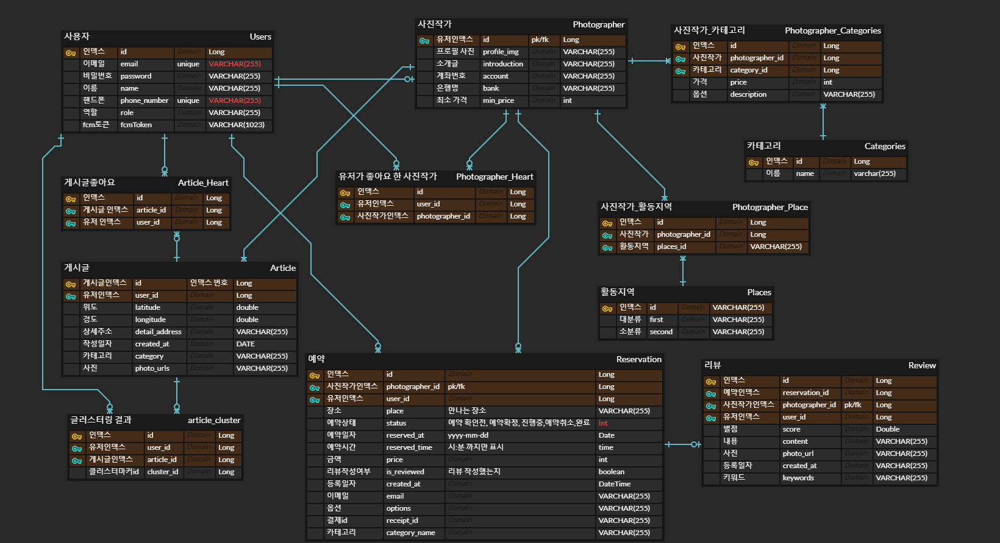

# ​🧡📷스마일(​SMILE)📷🧡


- SSAFY 8th PJT **Team D102**​ 🌞
- 프로젝트 기간 : `2023.01.03` ~ `2023.02.17`


<br>

# :green_book:​Contents

[:one: Specification](#one-specification)<br>
[:two: Flow Chart](#two-flow-chart)<br>
[:three: ERD](#three-erd)<br>
[:four: WIKI](#four-wiki)<br>
[:five: Contributor](#six-contributor)<br>


<br>

## ​:one:​ Specification

<table class="tg">
<tbody>
  <tr>
    <td><b>Architecture</b></td>
    <td>MVC</td>
  </tr>
<tr>
    <td><b>Design Pattern</b></td>
<td>Builder Pattern/Singleton Pattern</td>
</tr>
<tr>
    <td><b>DB</b></td>
<td>MySQL 8.0.23</td>
</tr>
<tr>
    <td><b>Dependency Injection</b></td>
<td>Gradle 7.6</td>
</tr>
<tr>
    <td><b>Strategy</b></td>
<td>Git Flow</td>
</tr>

<tr>
    <td><b>Third Party Library</b></td>
    <td> OAuth2, Kakao API, Google Cloud API, coolsms, </td>

</tr>
<tr>
    <td><b>Other Tool</b></td>
<td>Notion, Slack</td>
</tr>
</tbody>
</table>

<br>

<br>

## :two: API Document

<a href="https://documenter.getpostman.com/view/25240917/2s8ZDcxenB">API Document</a>

<br>

## :three: ERD



## :four: Server Architecture


<br>

## :five: Package Structure

```
📦 backend-smile
 ┣ 📂 api-module
 ┃ ┗ 📂 src/main
 ┃ ┃ ┃ ┗ 📂 java
 ┃ ┃ ┃ ┃ ┗ 📂 com.ssafy.api
 ┃ ┃ ┃ ┃ ┃ ┗ 📂 config
 ┃ ┃ ┃ ┃ ┃ ┗ 📂 controller
 ┃ ┃ ┃ ┃ ┃ ┗ 📂 dto
 ┃ ┃ ┃ ┃ ┃ ┗ 📂 service
 ┃ ┃ ┃ ┗ 📂 resources
 ┃ ┃ ┃ ┃ ┗ 🐘 build.gradle
 ┣ 📂 batch-module
 ┃ ┗ 📂 src/main
 ┃ ┃ ┃ ┗ 📂 java
 ┃ ┃ ┃ ┃ ┗ 📂 com.ssafy.batch
 ┃ ┃ ┃ ┃ ┃ ┗ 📂 config
 ┃ ┃ ┃ ┃ ┃ ┗ 📂 dto
 ┃ ┃ ┃ ┃ ┃ ┗ 📂 job
 ┃ ┃ ┃ ┃ ┃ ┗ 📂 service
 ┃ ┃ ┃ ┗ 📂 resources
 ┃ ┃ ┃ ┃ ┗ 🐘 build.gradle
 ┣ 📂 core-module
 ┃ ┗ 📂 src
 ┃ ┃ ┣ 📂 main
 ┃ ┃ ┃ ┗ 📂 java
 ┃ ┃ ┃ ┃ ┗ 📂 com.ssafy.core
 ┃ ┃ ┃ ┃ ┃ ┗ 📂 code
 ┃ ┃ ┃ ┃ ┃ ┗ 📂 entity
 ┃ ┃ ┃ ┃ ┃ ┗ 📂 exception
 ┃ ┃ ┃ ┃ ┃ ┗ 📂 repository
 ┃ ┃ ┃ ┃ ┃ ┗ 📂 service
 ┃ ┃ ┃ ┃ ┃ ┗ 📂 utils
 ┃ ┃ ┃ ┗ 📂 resources
 ┃ ┃ ┃ ┃ ┗ 🐘 build.gradle
 ┣ 📂 src
 ┃ ┣ 📂 main
 ┃ ┃ ┗ 📂 resources
 ┗ 🐘 build.gradle
```


<br>


## :six: WIKI
```
👉 Team Rules(Git, Coding Convention) 및 회의록
```
- [HOME](https://lab.ssafy.com/s08-webmobile4-sub1/S08P11D102/-/wikis/Home)
    - [1. Team Rules](https://lab.ssafy.com/s08-webmobile4-sub1/S08P11D102/-/wikis/1.-Team-Rules)
    - [2. Server Coding Convention]()
    - [3. 회의록]()


<br>


## :seven: Contributor

```
👉 팀원 소개와 역할 분담
```

<table class="tg">
<tbody>
    <tr>
        <td>김정은</td>
        <td>신민철</td>
        <td>서재건</td>
    </tr>
    <tr>
        <td><a href="https://github.com/kjjee99">@kjjee99</a></td>
        <td><a href="https://github.com/ringcho">@ringcho</a></td>
        <td><a href="https://github.com/sjk1052005">@sjk1052005</a></td>
    </tr>
    <tr>
        <td></td>
        <td></td>
        <td></td>
    </tr>
    <tr>
        <td>Server Dev</td>
        <td>Server Dev</td>
        <td>Server Dev</td>
    </tr>
    <tr>
        <td>작가 프로필, 예약 관련 기능 구현 / 배포</td>
        <td>게시글, 리뷰, 작가 추천 및 클러스터링 관련 기능 구현</td>
        <td>로그인/회원관리, 필터링, 스프링 배치 관련 기능 구현</td>
    </tr>
</tbody>
</table>


