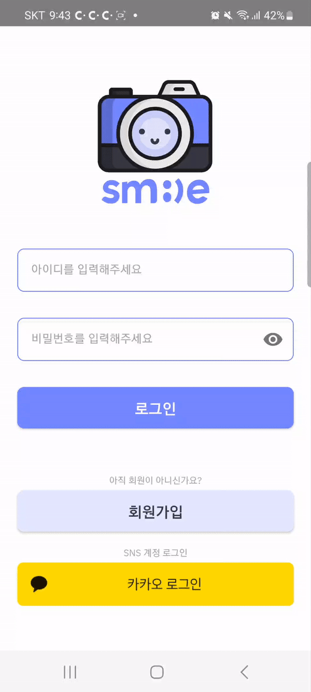
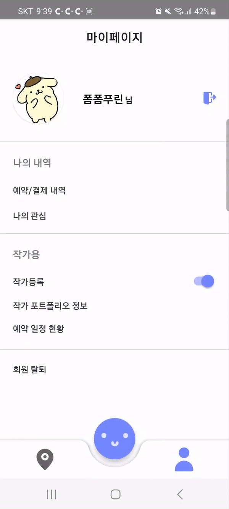

<h1 align="center" style="color:skyblue">SMILE</h1>

    

---

<h1 align="center" >기능 소개</h1>

# 회원가입
> 모든 유효성 검사를 완료해야 회원가입이 가능합니다.
---

    

# 로그인 & 로그아웃
> 로그인 시 아이디와 비밀번호 모두 일치해야 로그인에 성공합니다.   로그아웃은 `마이페이지`에서 우측 상단의 버튼을 누르면 로그아웃되고 로그인 화면으로 이동합니다.   카카오 로그인은 로그인 화면에서 하단에 위치해있습니다.

---

<figure>
    
    <figcaption>로그인</figcaption>
    
    <figcaption>카카오 로그인</figcaption>
    
    <figcaption>로그아웃</figcaption>
</figure>

# 사진작가 등록/수정/삭제
> 사진작가의 프로필 사진, 소갯말, 카테고리, 활동지역, 정산 계좌를 입력하면 사진작가로 등록할 수 있습니다. `작가 포트폴리오 정보` 탭에서 수정할 수 있고, 토글을 클릭하면 작가 등록을 취소할 수 있습니다.
---

    

# 메인화면

---

## 게시글 등록/조회/수정/삭제
> 작가 프로필에서 `게시글 업로드` 버튼을 클릭하면 게시글을 작성할 수 있습니다. 한 게시글 당 최대 3장의 사진을 업로드할 수 있고, 장소와 카테고리를 지정하여 작성할 수 있습니다.  게시글 수정과 삭제는 게시글 상세조회 화면에서 우측 하단의 점 세개를 클릭하면 바텀시트에서 클릭할 수 있습니다.

    
    

## 주소 등록 및 검색
> 메인 화면에서 제일 위에 있는 버튼('주소를 등록해주세요' 혹은 등록한 주소)을 누르면 주소를 검색하거나 현재 위치를 기반으로 등록할 수 있습니다.

    

## 주변 작가 목록
> 등록된 주소 기반으로 주변에 있는 작가가 검색되고 목록에서 작가를 클릭하면 사진 작가의 프로필이 조회됩니다. 옆에 있는 빈 하트를 누르면 관심 작가로 저장되고 속이 찬 하트로 변경됩니다. 속이 찬 하트를 누르면 관심 작가에서 해제되고 빈 하트로 변경됩니다.

    

## 관심 목록
> 마이페이지에서 하트를 누른 작가나 게시물의 목록을 확인할 수 있습니다.

    

## 작가 추천
> 좋아요를 누른 작가에 달린 리뷰를 기반으로 해당지역의 작가에 달린 리뷰와 비교하여 리뷰의 유사도 순으로 10명의 작가를 추천합니다.

    

## 검색
> 키워드로 검색 시 키워드가 포함된 작가와 게시글이 조회됩니다. 

    

# 지도
> 현재 위치를 중심으로 주변 게시글 목록을 마커로 찍어서 보여줍니다. 마커를 클릭하면 게시글을 확인할 수 있습니다.

---

    

# 예약
---

## 예약 등록
> 선택한 작가의 프로필에서 `예약하기` 버튼을 클릭하면 예약 화면이 나옵니다. 예약일자, 시간, 장소, 카테고리, 사진을 전송받을 이메일을 작성해 등록하기를 누르면 결제화면이 나타납니다. 결제를 완료하고 `예약 내역`에 들어가면 예약한 내역을 확인할 수 있습니다.

    

## 예약 취소
> 예약한 내역을 취소하고 싶을 때 `예약 내역`에서 `예약 취소` 버튼을 누르면 취소가 됩니다. 만약 고객이 취소한 경우 예약한 사진작가에게 알림이 가고, 사진작가가 취소한 경우에는 고객에게 알림이 갑니다.

    
    

## 리뷰등록
> 예약이 완료되면 리뷰를 남길 수 있습니다. 별점, 사진, 내용을 작성할 수 있습니다. 리뷰는 수정은 불가능하고 삭제만 가능합니다.

    

# 회원탈퇴
> `마이페이지`에서 하단에 위치한 `회원 탈퇴` 버튼을 클릭하면 연관된 모든 정보가 삭제됩니다. 예약도 모두 취소됩니다.

---

    

